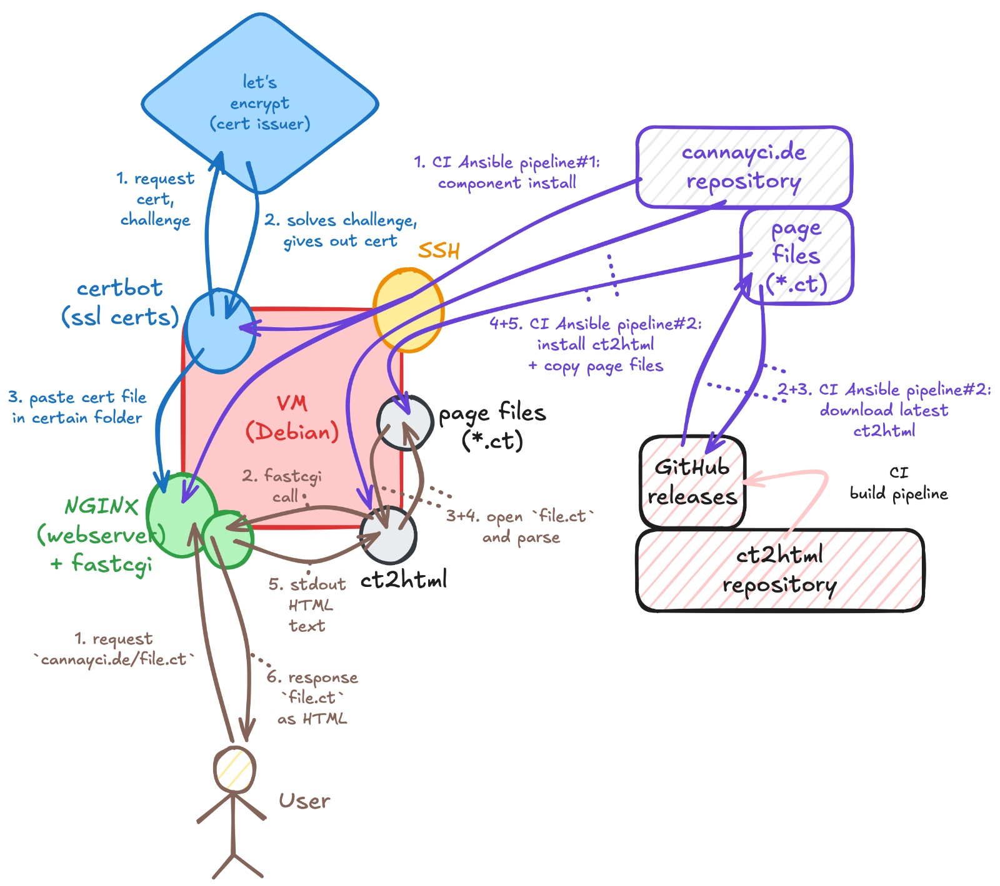

# [cannayci.de](https://cannayci.de)

This repo consists of:
- `install/`: Ansible installation of `certbot`, `nginx` and belonging configurations
- `pageroot/`: The pages root, starting with `pageroot/main.ct` - the so-called "index-page"
- `.github/workflows/deploy-nginx.yml`: Executing Ansible in manual pipeline to do the setup on a fresh VM
- `.github/workflows/install-page.yml`: Executing Ansible in per-commit pipeline to copy-on-commit page files into `/var/www/cannayci.de/` on the VM and install `ct2html` and the fastcgi helper into `/opt/ct2html`.

Usage does not need a description; look into the CI files.

## Motivation

I want to have a place where my notes and thoughts are gathered in a central place, even if they are not really meant for public space,
since I do not intend to have readers besides me and maybe some family member I want to send some text to.

I love [`latex`](https://de.wikipedia.org/wiki/LaTeX), which I got introduced to in university, and while others found `latex` to be extremely overcomplicated and used other alternative like [`typst`](https://en.wikipedia.org/wiki/Typst) (no `typst`-user, you're neither intelligent nor modern, and no, it is not better than `latex`) or just wrote in their ugly font on their tablet, I defined my own math commands and had fun spamming formulas looking like sentences in [Nubean](https://en.wikipedia.org/wiki/Nubian_languages) through something like `\x`.

`latex` may be pleasing for PDF-articles, or little books, but for even smaller texts like articles, where you would not share big compositions of settings-files for single article files.

Because of that, thinner and much "settings-less" is [Markdown](https://de.wikipedia.org/wiki/Markdown), but it lacks what I love: Commands.

Instead of (A): Using some Markdown-dialect, or (B) another DSL for writing small articles, I came up with my [ct2html](https://github.com/yungcxn/ct2html) project, which takes my own DSL and generates [HTML](https://de.wikipedia.org/wiki/Hypertext_Markup_Language) out of it. `ct` (`c`an's `t`ext) is a Markdown-like language with commands and other quirks to fulfill this need.
It is a really fun opportunity to experiment with [`zig`](https://ziglang.org/) -- my new love after playing with `C` for some serious time.

Through these motivations I can mix in my profession (platform and DevOps engineering) to setup a bare VPS, my hobby (coding) to build a HTML-Generator and my goal (to have a space for my notes) alltogether.

