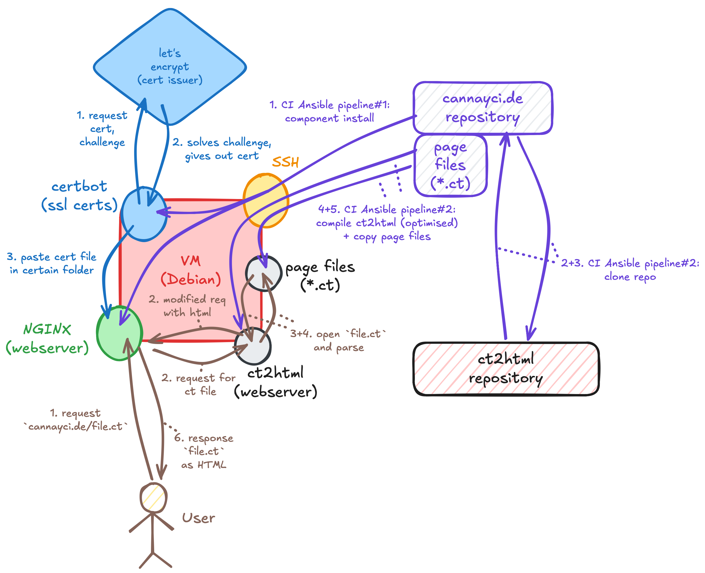

# [cannayci.de](https://cannayci.de)

This repo consists of:
- `install/`: Ansible installation of `certbot`, `nginx` and belonging configurations
- `pageroot/`: The pages root, starting with `pageroot/main.ct` - the so-called "index-page"
- `.github/workflows/deploy-nginx.yml`: Executing Ansible in manual pipeline to do the setup on a fresh VM
- `.github/workflows/install-page.yml`: Executing Ansible in per-commit pipeline to copy-on-commit page files into `/var/www/cannayci.de/` on the VM and install `ct2html`.
`ct2html` is built live on the VM due to the following reasons:
1. `zig` is relatively platform independent and supports many different cpu architectures.
2. As long there is `zig` available on the target machine, we can build the executable with optimisation flags, without only baseline CPU features.
3. I do not need overkill containerization for the executable due to it  only touching basic file and network IO features and nothing more than that, which is supported through `zig`s standard lib.

Usage does not need a description; look into the CI files.

